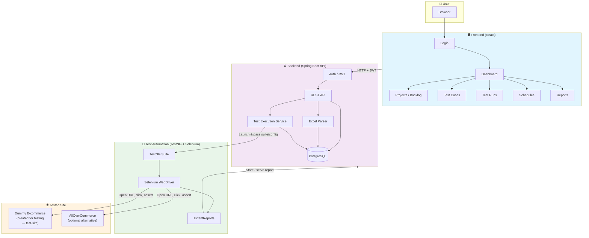
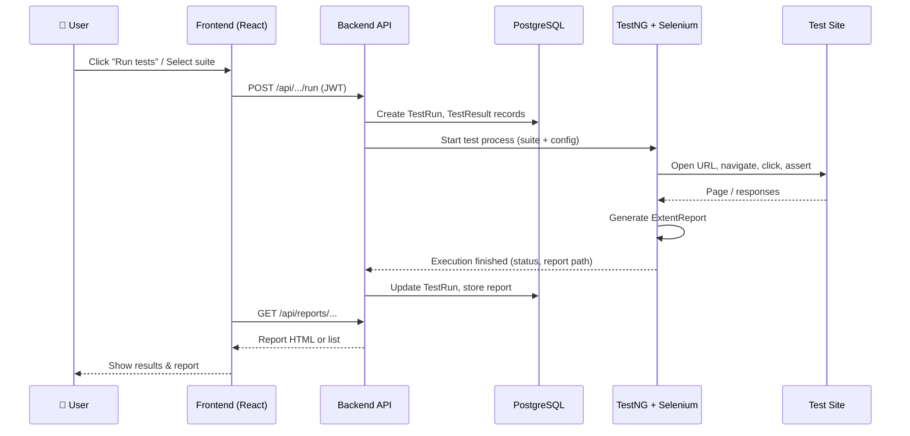
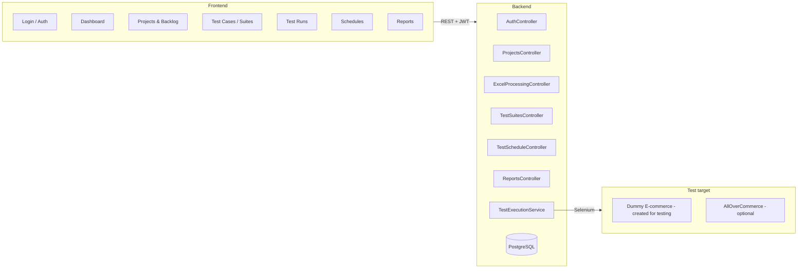
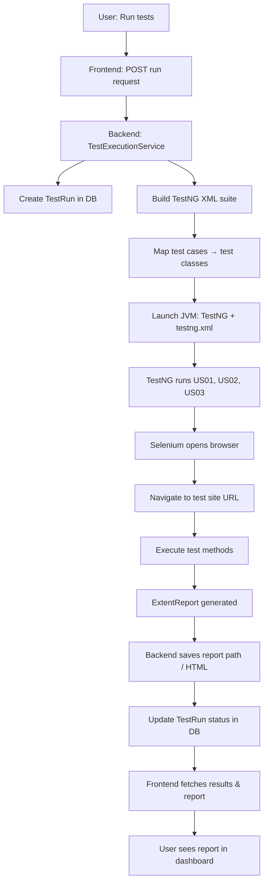
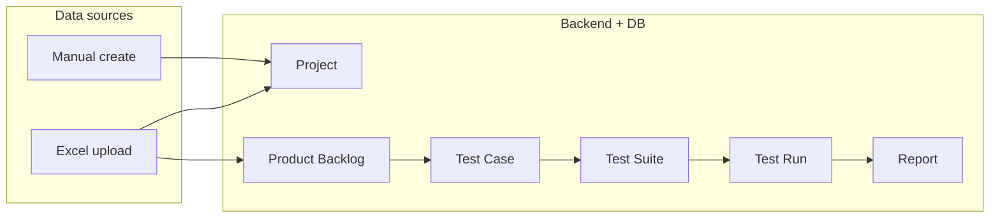
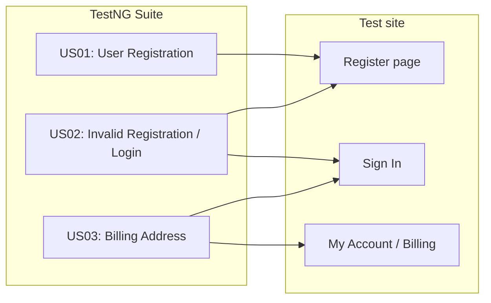
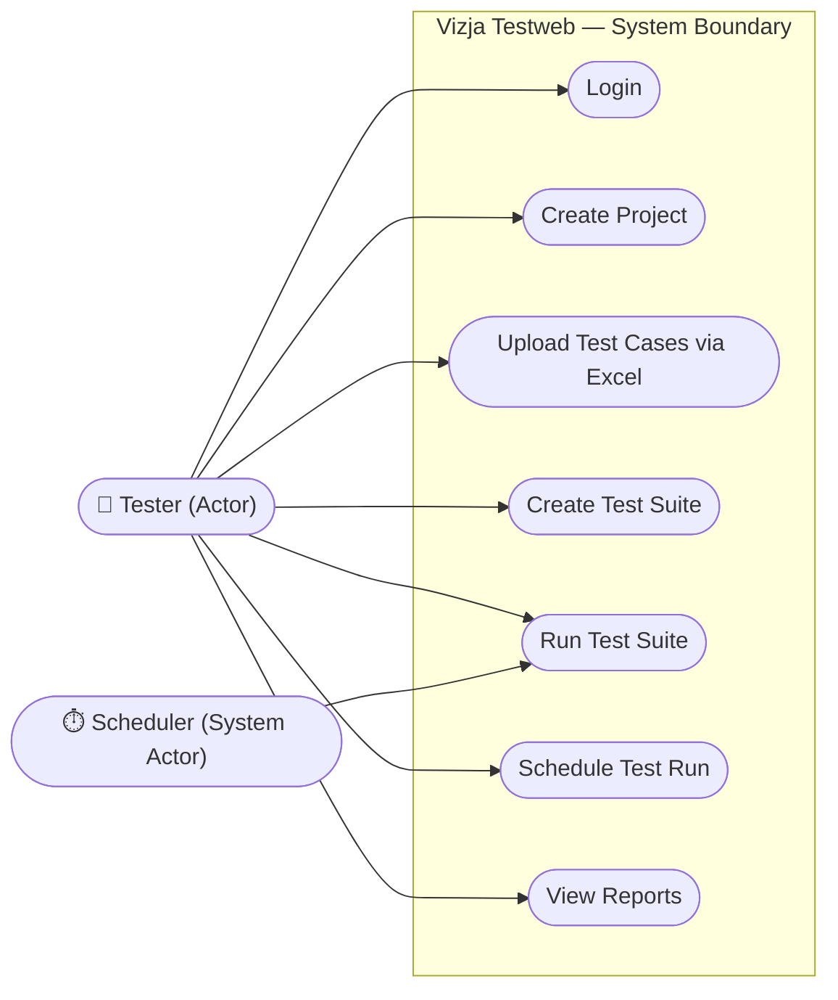

# Vizja Testweb — Architecture & Flow Diagrams

This file contains Mermaid diagrams for the project. You can view them:

- **VS Code:** Install the "Mermaid" or "Markdown Preview Mermaid Support" extension and open this file in preview.
- **GitHub/GitLab:** Diagrams render automatically in the Markdown preview.
- **Online:** Copy a code block to [mermaid.live](https://mermaid.live) to edit or export as PNG/SVG.

---

## 1. System overview — High-level architecture

How the main parts of the system connect: User, Frontend, Backend, Test automation, and the **dummy e-commerce site** created for this project for testing (AllOverCommerce is an optional alternative).

---

## 2. Sequence — User triggers a test run

Step-by-step flow when the user starts a test run from the dashboard.

---

## 3. Component view — What lives where

Main components and their responsibilities.

---

## 4. Test execution flow — From click to report

Detailed flow inside the backend when a test run is triggered.

---

## 5. Data flow — Projects, test cases, runs

How main entities relate and where data is stored.

---

## 6. User stories (tests) — US01, US02, US03

Which tests run and what they cover. Tests target the dummy e-commerce site created for this project.

---

## 7. Use Case Diagram — UML

Who uses the system and what they can do.

---

*Diagrams can be exported as images from [mermaid.live](https://mermaid.live) (paste the code block) or from VS Code with a Mermaid export extension.*
