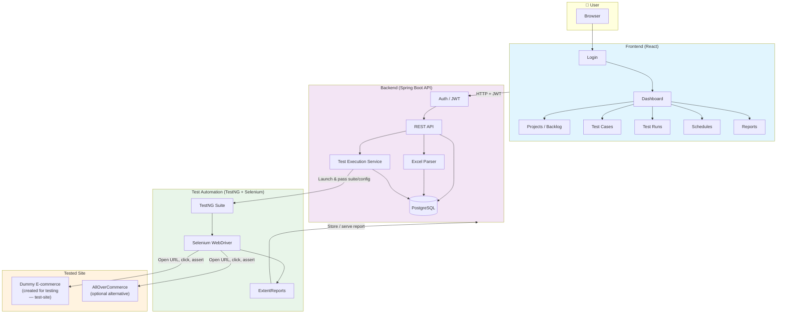

# Vizja Testweb — Test Automation Platform

A full-stack **test automation platform** with a web dashboard. It manages test projects, product backlogs, test cases, test runs, schedules, and reports. Automated tests (Selenium + TestNG) run against a target e-commerce site and results are stored and displayed in the dashboard.

<div align="center">
  

### Graduation Thesis Project
**University of Economics and Human Sciences in Warsaw**

**Student:** Buğra Han - 42078
  
---

[](https://www.oracle.com/java/)
[](https://spring.io/projects/spring-boot)
[](https://www.postgresql.org/)
[](https://testng.org/)
[](https://www.selenium.dev/)

</div>

---

## Table of Contents

- [Overview](#overview)
- [Architecture & Flow](#architecture--flow)
- [Diagrams (Mermaid)](#diagrams)
- [Project Structure](#project-structure)
- [Technology Stack](#technology-stack)
- [Prerequisites](#prerequisites)
- [Getting Started](#getting-started)
- [Test Site](#test-site)
- [Architecture diagrams](#architecture-diagrams)
- [License](#license)

---

## Overview

**Vizja Testweb** consists of three main parts:

| Component | Description |
|-----------|-------------|
| **Frontend** | React (TypeScript) web app: login, dashboard, projects, Excel upload, test cases, test runs, schedules, and HTML reports. |
| **Backend** | Spring Boot REST API: auth (JWT), projects, Excel parsing, test execution orchestration, schedules, and report storage. |
| **Test automation** | TestNG + Selenium tests in the backend; they run in a separate JVM and report results back. Target site: a **dummy e-commerce website** created for this project (in `test-site/`) for testing purposes. [AllOverCommerce](https://allovercommerce.com) can be used as an optional alternative. |

Users log in via the dashboard, create/import projects from Excel, define test cases and suites, trigger test runs or schedules, and view results and ExtentReports in the UI.

---

## Architecture & Flow

The diagram below shows how the **frontend**, **backend**, **test automation**, and **test site** interact.



### High-level flow

1. **User** opens the React app, logs in (JWT), and uses the dashboard.
2. **Frontend** calls the **Backend** REST API for projects, test cases, runs, schedules, and reports.
3. **Backend** stores data in **PostgreSQL** and, when a run is triggered, starts the **Test automation** (TestNG + Selenium).
4. **Test automation** drives a browser (Chrome/headless) against the **Test site** — a dummy e-commerce website created for this project for testing — and generates **ExtentReports**; the backend stores/serves them.
5. **User** sees results and reports in the **Frontend**.

### Diagrams

Detailed **Mermaid diagrams** (system overview, sequence, components, test flow, data flow, user stories) are in **[docs/DIAGRAMS.md](docs/DIAGRAMS.md)**. Open that file in VS Code (with a Mermaid extension), view it on GitHub, or paste the code into [mermaid.live](https://mermaid.live) to export as PNG/SVG.

---

## Project Structure

```
testweb/
├── frontend/                 # React dashboard (TypeScript)
│   ├── src/
│   │   ├── api/               # API clients (auth, projects, tests, reports, …)
│   │   ├── components/       # UI: tabs, tables, Excel viewer, auth, layout
│   │   ├── pages/            # Login, Settings, TestDashboard
│   │   └── ...
│   └── package.json
│
├── backend/                   # Spring Boot API + test automation
│   ├── src/main/java/com/vizja/testweb/
│   │   ├── Application.java
│   │   ├── config/           # Security (JWT, CORS)
│   │   ├── controller/       # Auth, Projects, Excel, TestSuites, Reports, Schedules
│   │   ├── model/            # Project, TestCase, TestRun, TestSchedule, User, …
│   │   ├── repository/       # JPA repositories
│   │   ├── security/         # JWT, UserDetails
│   │   └── service/          # Excel parsing, test execution, reports, schedules
│   ├── src/test/java/com/vizja/testweb/
│   │   ├── pages/            # Page objects (e.g. Anasayfa)
│   │   ├── tests/            # US01, US02, US03 TestNG tests
│   │   └── utilities/        # Driver, ConfigReader, ExtentReport, ReusableMethods
│   ├── configuration.properties   # Test data & test site URL
│   ├── testng.xml            # TestNG suite (US01–US03)
│   └── pom.xml
│
└── test-site/                # Dummy e‑commerce site created for testing
    ├── index.html
    ├── css/, js/
    └── README.md
```

---

## Technology Stack

| Layer | Technologies |
|-------|--------------|
| **Frontend** | React 18, TypeScript, React Router, Redux Toolkit, TanStack Query, Axios, Radix UI, Recharts, Tailwind |
| **Backend** | Java 17, Spring Boot 2.7, Spring Security, JWT, Spring Data JPA, PostgreSQL |
| **Test automation** | TestNG 7, Selenium 4, WebDriverManager, ExtentReports, JavaFaker, Apache POI |
| **Database** | PostgreSQL |
| **Test site** | Dummy e-commerce site (HTML/CSS/JS) created for this project for testing; optionally [AllOverCommerce](https://allovercommerce.com) |

---

## Prerequisites

- **Node.js** (e.g. 18+) and **npm**
- **Java 11** and **Maven**
- **PostgreSQL** (for backend)
- **Chrome** (or another browser supported by Selenium; tests use Chrome by default)

---

## Getting Started

### 1. Database

Create a PostgreSQL database (e.g. `testautomationdb`) and set the connection in:

`backend/src/main/resources/application.properties`

```properties
spring.datasource.url=jdbc:postgresql://localhost:5432/testautomationdb
spring.datasource.username=postgres
spring.datasource.password=YOUR_PASSWORD
```

### 2. Backend

```bash
cd backend
mvn spring-boot:run
```

API runs at **http://localhost:8081** (or the port in `application.properties`).

### 3. Frontend

```bash
cd frontend
npm install
npm start
```

Dashboard runs at **http://localhost:3000**. Set the API base URL in `frontend/.env` if needed (e.g. `REACT_APP_API_URL=http://localhost:8081`).

### 4. Test site (dummy e-commerce)

A **dummy e-commerce website** was created for this project for testing (register, sign in, billing). Serve it so the automated tests can run against it.

```bash
cd test-site
npx serve -l 3000
```

Then in `backend/configuration.properties` set:

```properties
testSiteUrl=http://localhost:3000/
allowerCommerceUrl=http://localhost:3000/
```

Optionally, tests can target **https://allovercommerce.com** by changing these URLs.

### 5. Running automated tests

- From the dashboard: use **Run tests** or **Schedules** to trigger runs via the API.
- From the command line:

  ```bash
  cd backend
  mvn test
  ```

  This runs the TestNG suite defined in `testng.xml` (US01, US02, US03).

---

## Test Site

A **dummy e-commerce website** was created for testing (in the **test-site** folder): static HTML/CSS/JS with register, sign in, and duplicate-check flows. It is used as the target for the automated tests; locators align with the backend page object (`Anasayfa.java`). See `test-site/README.md` for how to run it and point the tests at it.

Optionally, tests can be configured to use **AllOverCommerce** instead.

---

## 🤝 Contributing

This is a graduation thesis project. Contributions are welcome for educational purposes.

### Development Workflow

1. Fork the repository
2. Create a feature branch (`git checkout -b feature/amazing-feature`)
3. Commit your changes (`git commit -m 'Add amazing feature'`)
4. Push to the branch (`git push origin feature/amazing-feature`)
5. Open a Pull Request

---

## 📄 License

This project is part of a graduation thesis at the **University of Economics and Human Sciences in Warsaw**.

**Student:** Buğra Han (ID: 42078)  
**Academic Year:** 2025/2026

---

## 📞 Contact

**Buğra Han**  
Student ID: 42078  
University of Economics and Human Sciences in Warsaw

---

<div align="center">
  <p>Made it for graduation thesis</p>
  <p>© 2026 Uniwersytet Vizja - All Rights Reserved</p>
</div>
